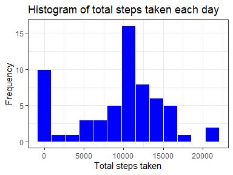
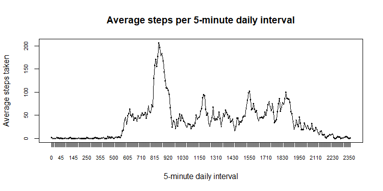
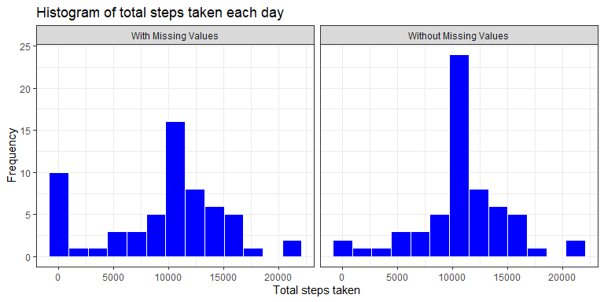
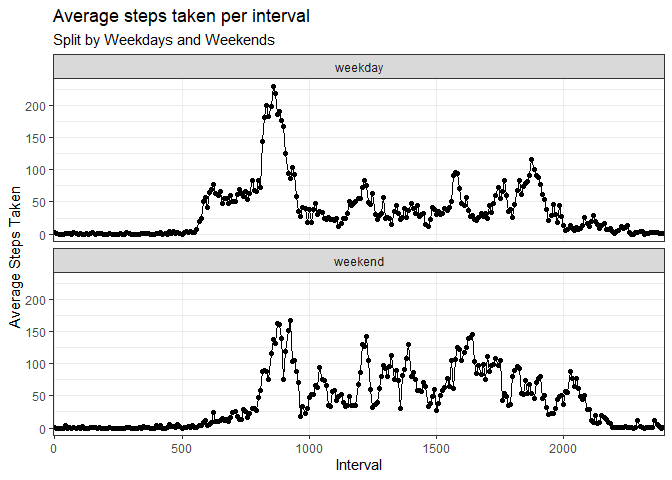

## Loading and preprocessing the data

The first step that needs to be taken is to load the dataset.
It's important to make sure the **activity.zip** file is located in the current 
working directory, otherwise its full path needs to be informed within the 
*read.csv* function.


```r
data <- read.csv("activity.csv")
```
Below is a quick glimpse of the recently loaded data.

```r
str(data)
```

```
## 'data.frame':	17568 obs. of  3 variables:
##  $ steps   : int  NA NA NA NA NA NA NA NA NA NA ...
##  $ date    : Factor w/ 61 levels "2012-10-01","2012-10-02",..: 1 1 1 1 1 1 1 1 1 1 ...
##  $ interval: int  0 5 10 15 20 25 30 35 40 45 ...
```
The output above show this data set has over 17k rows and 3 variables.  
  
The *steps* column has several NA's but those will be kept for now.  
  
Additionally, the *interval* column, which is supposed to inform the 5-minute 
interval in which the measurement was taken is being treated as an integer. 
Since they represent intervals and are going to be repeated along the dataset,
it's a good idea to convert them into factors.

```r
data$interval <- as.factor(data$interval)
```
With these changes, it's ok to move on with the analysis.  

## What is the mean total number of steps taken per day?
In order to compute the mean and median steps per day from our data, it must be 
transformed first, by aggregating the sum of total steps by date. The *dplyr* 
package will be used for that. The *ggplot* package will also be loaded so the 
daily steps amount can be inspected visually.

```r
# Lading required libraries. 
# 'dplyr' is used for easier data manipulation and 'ggplot' is used for plotting
library(dplyr)
library(ggplot2)

# Creating a data frame containing the total steps taken each day
steps.per.day <- data %>%
    group_by(date) %>%
    summarize(total.steps = sum(steps, na.rm = TRUE))

# Plotting the histogram of daily steps per day
ggplot(data = steps.per.day, aes(x = total.steps)) +
    geom_histogram(col = "white", fill = "blue", bins = 13) +
    ggtitle(label = "Histogram of total steps taken each day") +
    xlab("Total steps taken") + ylab("Frequency") +
    theme_bw()
```

<!-- -->
  
From the histogram, it's possible to see that there's a high concentration of 
values around 10,000 and that a lot of days had no steps recorded. The mean and 
the median of the dataset were computed so their exactly values can be known.

```r
# Computing the mean steps per day
mean(steps.per.day$total.steps)
```

```
## [1] 9354.23
```

```r
# Computing the median steps per day
median(steps.per.day$total.steps)
```

```
## [1] 10395
```

## What is the average daily activity pattern?
This data also offers the possibility of analyzing the pattern of activities by
interval. As mentioned earlier, the *interval* column contains several 5-minute
intervals along each day. In order to see the average steps taken in each of
them, that data will be aggregated by interval and compute the average steps 
of each one.

```r
steps.per.interval <- data %>%
  group_by(interval) %>%
  summarize(average.steps = mean(steps, na.rm = TRUE))
```
With the data in the right format, it's possible to see it in a time series 
plot.

```r
# Adjusting the size of the axis labels
par(cex.axis = 0.7)

# Plotting the average steps per interval
plot(steps.per.interval$average.steps ~ steps.per.interval$interval, type = "l",
     xlab = "5-minute daily interval", ylab = "Average steps taken", main =
       "Average steps per 5-minute daily interval")
lines(steps.per.interval$average.steps)
```

<!-- -->

The plot above shows a high peak of steps in the morning. The *max()* function can 
help identifying the exact intveral with the maximum value.

```r
# Subset the data to show the row where the average steps equals the maximum value found in the data.
steps.per.interval[steps.per.interval$average.steps == max(steps.per.interval$average.steps),]
```

```
## # A tibble: 1 x 2
##   interval average.steps
##   <fct>            <dbl>
## 1 835               206.
```

It's easy to identify now that the highest amount of average steps is achieved 
at 8:35, with 206.17 steps taken in average among all dates that were measured.

## Imputing missing values
So far all the analysis was performed with missing values in the data.


```r
# Obtain the total number of missing values (NA) in the dataset
sum(is.na(data$steps))
```

```
## [1] 2304
```

The 2,304 missing values represent **13.1%** 
of all the measurements in the data and they may introduce bias into some calculations or summaries.  
  
In order to overcome this, the NA values will be replaced with the mean of the 
steps taken for that particular interval.  

Those means are already stored in the object **steps.per.interval**, so it'll be used in a join operation to retrieve the  interval average whenever there is an NA in the original data.

```r
# Fill in NA's with the mean of the corresponding interval (This is accomplished with the first 3 lines of code from the chain below).
# However, since the transforming operation creates an additional column with the missing values replaced, (adjusted.steps), in order to preserve the structure of the original dataset, the steps column (which contains NA's) is removed, then the newly created column (adjusted.steps) is renamed as "steps". Finally, the column ordering is arranged to be just like the original data.
data.adjusted <- data %>%
  left_join(y = steps.per.interval, by = "interval") %>%
  mutate(adjusted.steps = ifelse(is.na(steps), average.steps, steps)) %>%
  select(-steps) %>%
  rename(steps = adjusted.steps) %>%
  select(steps, date, interval)
```

Without the missing values, the histogram created previously will be replicated and put side by side with the new version so that the differences after imputing missing values can be inspected.


```r
# Just like before, the total steps per day needs to be calculated by aggregating the sum of steps per date.
steps.per.day.adjusted <- data.adjusted %>%
  group_by(date) %>%
  summarize(total.steps = sum(steps))

# For plotting purposes, a temporary dataframe will be created to bind the rows of both histogram's data sources, with the addition of a column to differentiate them.
temp.plot.df <- rbind(data.frame(date = steps.per.day$date, total.steps = steps.per.day$total.steps, data.source = "With Missing Values"), data.frame(date = steps.per.day.adjusted$date, total.steps = steps.per.day.adjusted$total.steps, data.source = "Without Missing Values"))

# Plotting the histogram of daily steps per day from both states (with and without missing values)
ggplot(data = temp.plot.df, aes(x = total.steps)) +
  geom_histogram(col = "white", fill = "blue", bins = 13) +
  ggtitle(label = "Histogram of total steps taken each day") +
  xlab("Total steps taken") + ylab("Frequency") +
  facet_wrap(~data.source) +
  theme_bw()
```

<!-- -->

After the imputation process, the concentration of values around 10k has increased.
Visually, the other bins seem not to have had meaningful changes.

## Are there differences in activity patterns between weekdays and weekends?

Lastly, the dataset with the adjusted values can be used to check the differences in patterns between weekdays and weekends.  
  
To accomplish this, a factor column to differentiate them is created in the adjusted raw data (*data.adjusted*).  
  
Then, an aggregation per *interval* and *weekday type* is created. This is done and stored in the *steps.per.interval.adjusted* dataframe.  
  
Finally, the plot is generated.

```r
# Create the differentiation between weekday and weekend in the adjusted raw data.
# The 'wday' component of a POSIXlt object holds the info for the day of week.
data.adjusted <- data.adjusted %>% 
  mutate(date.type = ifelse(as.POSIXlt(as.Date(date))$wday %in% c(0,6), "weekend", "weekday"))

# Set the date.type column to be a factor
data.adjusted$date.type <- as.factor(data.adjusted$date.type)

# Create the steps.per.interval.adjusted dataframe
steps.per.interval.adjusted <- data.adjusted %>%
  group_by(date.type, interval) %>%
  summarize(average.steps = mean(steps))

# Generate the plot
ggplot(data = steps.per.interval.adjusted, aes(x = interval, y = average.steps, group = 1)) +
  geom_point() + geom_line() +
  facet_wrap(~date.type, nrow = 2) +
  scale_x_discrete(name = "Interval", breaks = c("0", "500", "1000", "1500", "2000")) +
  scale_y_continuous(name = "Average Steps Taken") +
  ggtitle(label = "Average steps taken per interval", subtitle = "Split by Weekdays and Weekends") +
  theme_bw()
```

<!-- -->

From the plot, it's pssible to infer that during weekends, the steps are more distributed along the day whereas in weekdays, there is a large concentration of steps around 9 AM.  
  
Another interesting fact is that during weekends, the activity seems to start a little bit later than in weekdays. Notice that the activity curve has a steep increase around 6 AM during weekdays and in weekends this is noticed around 7 AM ~ 8 AM. 
